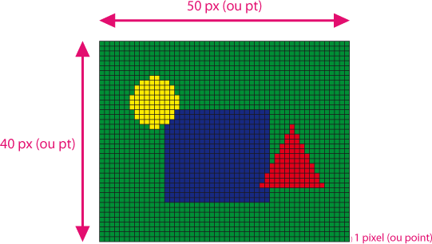
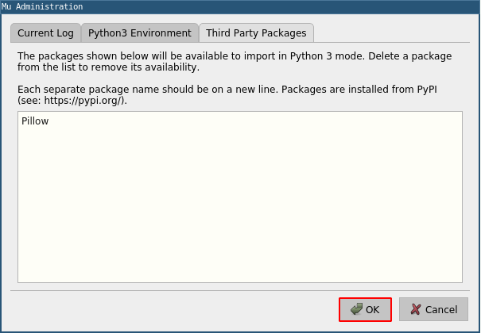
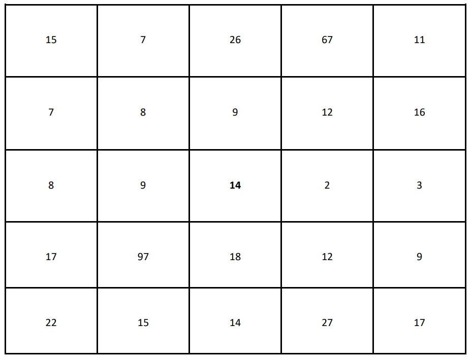

## Introduction aux images matricielles
Une image matricielle est une image représentée sous forme de matrice de points de couleurs (pixels). 





Dans ce TP, nous utiliserons la représentation Rouge Vert Bleu (RVB ou RGB en anglais) pour donner une large palette de couleur aux pixels de nos images. 

## Introduction à la bibliothèque PIL (Python Imaging Library)

PIL est une bibliothèque de traitement d'image écrite pour Python. C'est celle-ci que nous utiliserons durant toute la durée du TP afin d'appliquer nos filtres et manipuler les images.

Cette bibliothèque n'étant pas disponible de base sur ``mu-editor``, il est nécessaire de l'installer.

Voici la démarche à suivre :

#### 1 - Aller dans les paramètres


#### 2 - Cliquer sur l'onglet "Third Party Packages"


#### 3 - Ecrire "Pillow" puis valider



Et voilà! La blibliothèque est installée. Maintenant intéressons nous à son fonctionnement.


### Utiliser la blibliothèque PIL

PIL est une bibliotheque assez large alors voici une compilation essentielle des fonctions que vous devriez utiliser durant ce TP.

```Python
Mon_image = Image.open("cat.png") # Ouvrir une image depuis ton ordinateur.
Nouvelle_image = Image.new(mode = "RGB", size = (1920, 1080)) # Creer une nouvelle image.
Largeur = Mon_image.width  # Obtenir la largeur d'une image.
Hauteur = Mon_image.height # Obtenir la hauteur d'une image.
Matrice = Mon_image.load() # Obtenir la matrice de couleur de chaque pixel d'une image.
(Rouge, Vert, Bleu) = Matrice[0, 0] # Obtenir la composante RVB/RGB d'un pixel.
Matrice[0, 0] = (255, 255, 255)  # Changer la couleur d'un pixel.
```

Maintenant, au travail !


## Les filtres

Tout au long de ce TP nous travaillerons avec cette image de référence :


### Exercice 1 : Faire appliquer un filtre

Pour appliquer tous les filtres de cette premiere partie nous allons construire la fonction ``ApplyFilter``
Cette fonction prend en paramètre une image et une autre fonction.

Voici un exemple d'un passage de fonction en paramètre:

Imaginons que nous avons un nombre $x$ et que nous souhaitons lui associer differentes valeurs.

```Python
def AppliquerFonction(x, fonction):
	return fonction(x)

def FonctionCarre(x):
	return x*x

def MaFonction(x):
	return 5*x + 1

AppliquerFonction(3, FonctionCarre) # Resultat : 9
AppliquerFonction(3, MaFonction)	# Resultat : 16
```

**But  : Ecrire la fonction ``ApplyFilter(image, filter)`` qui applique le filtre rentré en paramètre sur la couleur de chaque pixel d'une image. La fonction doit retourner une nouvelle image.**

### Exercice 2 : Filtre de niveau de gris

Le niveau de gris est defini par la relation suivante : 
``Resultat = 0.2126 * Rouge + 0.7152 * Vert + 0.0722 * Bleu``


**But : Ecrire la fonction ``Grayscale(color)`` qui applique un filtre de niveau de gris sur une couleur. La fonction doit retourner la nouvelle couleur. **

Résultat souhaité :


### Exercice 3 : Filtre cyan

**But : Ecrire la fonction ``Cyan(color)`` qui applique un filtre cyan sur une couleur. La fonction doit retourner la nouvelle couleur **

*__Tips__: S'intéresser au fonctionnement de la synthese additive : https://fr.wikipedia.org/wiki/Synth%C3%A8se_additive*

Résultat souhaité :


### Exercice 4 : Filtre negatif

Le négatif d'une couleur est donné par les relations suivantes:

Rouge = 255 - Rouge
Vert = 255 - Vert
Bleu = 255 - Bleu

**But : Ecrire la fonction ``Negative(color)`` qui applique un filtre négatif sur une couleur. La fonction doit retourner la nouvelle couleur. **

Résultat souhaité :


## Manipulation d'image

### Exercice 5 : Symétrie en X

**But : Ecrire la fonction ``SymmetryX(image)`` qui applique une symétrie en X sur une image. La fonction doit retourner une nouvelle image. **

Résultat souhaité :


### Exercice 6 : Symétrie en Y

**But : Ecrire la fonction ``SymmetryY(image)`` qui applique une symétrie en Y sur une image. La fonction doit retourner une nouvelle image. **

Résultat souhaité :


### Exercice 7 : Rotations

**But : Ecrire la fonction ``RotateN(image, n)`` qui applique N fois une rotation droite (90 degres) sur une image. La fonction doit retourner une nouvelle image. **

Résultat souhaité pour n = 2 :


Résultat souhaité pour n = 9 :


### Exercice 8 : Pourcentage de différence

**But : Ecrire la fonction ``Diff(image1, image2)`` qui calcule le pourcentage de différence entre deux images. La fonction doit retourner un entier.**


Exemple : Pour ``Diff(ref_image, noisycat)`` le resultat doit être de 3%.

### Exercice 9 : Réduction de bruit

Pour cet exercice vous allez devoir appliquer un filtre median sur l'image. Le filtre median remplace la couleur d'un pixel par la couleur de la valeur médiane des pixels de son voisinage et de lui-meme.

**Exemple :**

Prenons une matrice avec des valeurs aleatoires pour illustrer :

Ici nous nous interessons aux de voisins de 250,


La valeur médiane ici sera de 14 car si l'on trie chaque valeur par ordre croissant on obtient:


**Rappel : La mediane correspond à la valeur du (n + 1)/2 ième nombre de de cette liste**.

Nous remplaçons donc **25** par **14**.



**But : Ecrire la fonction ``NoiseReduction(image)`` qui applique un filtre median sur une image. **

**Pour des raisons de simplicité appliquez ce filtre sur les pixels dans l'intervalle ([2, largeur - 2], [2, - hauteur - 2]).**

**La fonction doit retourner une nouvelle image. **

*__Tips__ : Tu peux utiliser la fonction sort() de python pour trier une liste*

```Python
ma_liste = [1, 5, 3, 7, 2, 9]
ma_liste.sort()
# ma_liste = [1, 2, 3, 5, 7, 9]
```

Résultat souhaité:


## Conclusion :


**But : Utilisez la fonction ``Diff`` et observez le resultat.**


## Bonus : convolution

